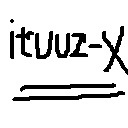

# ituuz-x 框架文档
## 介绍
ituuz-x是一个cocos creator游戏开发一个集成框架，也是一个工具集。其包括常用用的项目管理的mvc架构，以及静态数据、本地化、资源管理、网络等模块，后续还会不断拓展新的模块或工具。

### 关注我的公众号，获取更多内容，同时也是对我的最大支持。
<!--  -->


[项目主页（如果方便的话，可以点进去帮点一下广告，给予我一点支持）：http://ituuz-x.ituuz.com/](http://ituuz-x.ituuz.com/)

## 开始使用
### 环境依赖
- nodeJS：可到官网直接下载对应平台的稳定版本安装即可[https://nodejs.org/](https://nodejs.org/)
- 以下几个都是项目中用到的第三方模块，创建新项目时使用npm install进行安装即可：
    - protobufjs：pb数据压缩解析模块，框架中用于数据传输和存储。
    - xlsx：用于解析excel的模块，框架中静态数据源文件为excel文件。
    - swig：模版模块，配合框架使用的插件中生成代码使用了该模块。

### Hello World
1. 创建cocos creator工程并在工程的assets目录下创建一个目录用于存放框架代码，名字可以按照自己的需求创建，我们这里叫`Libs`。
2. 将框架项目`ituuzx`目录下的所有文件（`不包括ituuzx`目录）copy到刚刚创建的`Libs`目录下。
3. 复制框架项目根目录下的接口声明文件`itz.d.ts`到新创建的cocos creator工程目录下，与项目中的`creator.d.ts`文件同级。
4. 在新建工程的初始场景上挂载一个初始脚本，作为整个工程的运行入口，我们将在这里初始化框架，使游戏在框架的维护下开始运行。在例子工程中这个场景是:`helloworld.fire`场景，该场景上挂载的初始脚本是:`Helloworld.ts`。
5. 初始化框架，我们调用`it.Framework.start()`接口来初始化框架。该接口有很多参数，我们目前只关心第一个参数就行了。下面我们来初始化框架，并运行第一个场景，我们只知道start传入的参数是一个场景就行了，下一点我们再说参数的内容：
```javascript
    // 初始化框架，并运行第一个场景
    it.Framework.start({
        medClass: "GuideScMediator",
        viewClass: "GuideScView",
        children: []
    });
```
6. 你一定好奇第5点中接口的参数是什么东西，别急，我们现在来解释。`it.Framework.start`接口的第一个参数是必传的，它是一个场景配置对象，该对象中包含一个`medClass`和`viewClass`是必须有的，分别代表场景控制类和场景显示类。至于为什么是两个类，我们后面再讲，眼前先把工程运行起来。下面我们创建接口里配置的两个类`GuideScMediator`和`GuideScView`，具体的类内容可以参考例子工程中`assets/Script/scene/`目录中这两个类的ts文件。此时项目就可以正常运行了，只不过什么也没有，仅有一个空场景。
7. 下面我们为空场景添加一个界面，在框架里我们称作`view`，每个view都由两个类构成，类似与上面的场景类。这两个类分别是中介者Mediator，负责逻辑控制。另一个是界面View，负责显示。现在开始创建它们:


### MVC

## 插件

## API

## 工作流